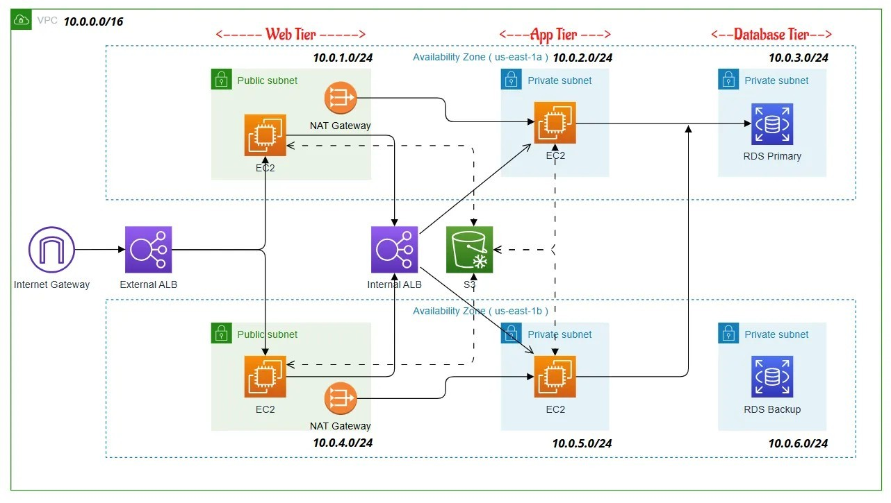
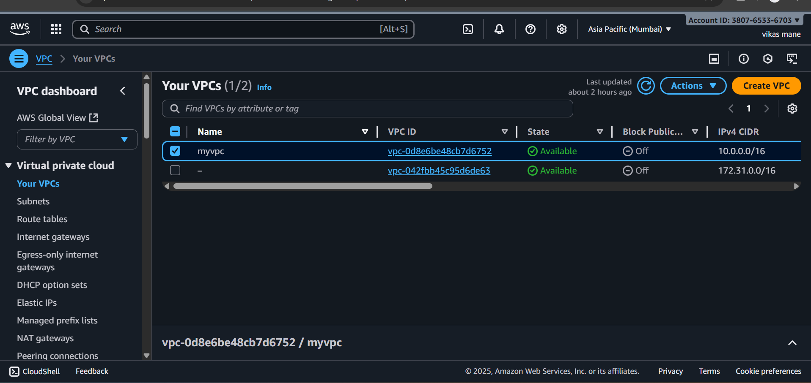
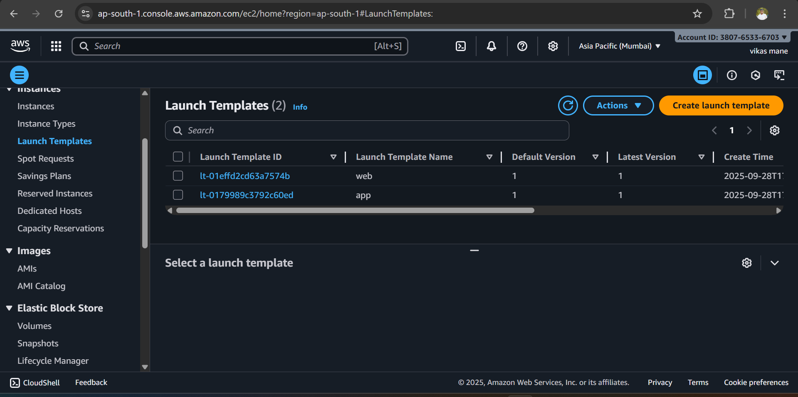

# Three-Tier Architecture on AWS  

This project demonstrates the implementation of a **Three-Tier Architecture** on AWS using core services such as **VPC, Subnets, EC2, RDS, and Load Balancer**.  
It follows the classic model of **Presentation Layer → Application Layer → Database Layer**.

---
## 🖼️ Final Architecture Diagram

---

##  Architecture Overview
- **VPC** → Created custom Virtual Private Cloud for isolated networking  
- **Subnets** → Public and Private subnets for better security & scalability  
- **Security Groups & NACLs** → Defined rules for inbound/outbound traffic  
- **EC2 Instances** → Hosted the application in the Application layer  
- **RDS (MySQL)** → Managed Database in the Database layer  
- **Elastic Load Balancer (ALB)** → Distributed traffic across multiple EC2 instances  
- **Internet Gateway + NAT Gateway** → Enabled controlled internet access  

---

## Architecture Diagram

##  Implemented Steps with Screenshots  

### 1. **Networking Setup**
- Created a **Custom VPC**
- Added **Public & Private Subnets**
- Configured **Route Tables, IGW, and NAT Gateway**

 

---

### 3. **Application Layer**
- Launched **EC2 Instances** in Private Subnets  
- Installed **Apache/PHP** and deployed `form.html` + `submit.php`  

  

---

### 4. **Database Layer**
- Launched **RDS MySQL Database** inside Private Subnet  
- Connected EC2 Application to Database securely  

 

---

### 5. **Load Balancer Layer**
- Created an **Application Load Balancer** in Public Subnet  
- Registered EC2 instances in Target Group  

---

### 6. **Testing & Validation**
- Accessed Application via **Load Balancer DNS**  
- Submitted form → Data successfully stored in RDS  

---

##  Security Considerations
- Used **Private Subnets** for Application and Database layers  
- **Security Groups** applied with the principle of **least privilege**  
  - Load Balancer → allows HTTP/HTTPS from the internet  
  - EC2 → allows traffic only from Load Balancer  
  - RDS → allows access only from EC2  
- **IAM Roles** assigned for secure access (no hardcoded credentials)  
- Enabled **Encryption at rest** for RDS database  
- Configured **NACLs** for subnet-level protection  

---

##  Performance Features
- **Elastic Load Balancer** ensures high availability and traffic distribution  
- Deployed **multiple EC2 instances** in Auto Scaling Group (optional)  
- Used **Multi-AZ RDS Deployment** for database reliability  
- Configured **NAT Gateway** to allow private instances to securely access the internet for updates  
- Optimized EC2 instances with appropriate **instance types**  

---

##  Usage
1. Deploy the architecture on AWS (VPC, Subnets, EC2, RDS, ALB)  
2. Place `form.html`, `submit.php`, and `db.php` on EC2 instances  
3. Connect to the Application via **Load Balancer DNS**  
4. Submit form → Data gets stored in **RDS Database**  
5. Use the database for analytics, reporting, or backend integration  

---

##  Monitoring
- Used **Amazon CloudWatch** to monitor:  
  - CPU Utilization & Memory of EC2 instances  
  - Database connections & query performance on RDS  
  - Latency & traffic metrics from Load Balancer  
- Configured **CloudWatch Alarms** for high CPU usage and RDS storage thresholds  
- Enabled **VPC Flow Logs** for monitoring traffic flow  
- Integrated **AWS CloudTrail** for auditing API calls  

---

##  Conclusion
This project demonstrates how to build a **scalable, secure, and highly available Three-Tier Architecture** on AWS by separating:  
- **Presentation Layer** (Load Balancer + EC2 Frontend)  
- **Application Layer** (EC2 with PHP/Apache)  
- **Database Layer** (RDS MySQL)  

By leveraging AWS services such as **VPC, Subnets, RDS, and ELB**, we achieved a secure, modular, and production-ready setup that can be extended further with **Auto Scaling, CI/CD, and advanced DevOps practices**.  

---

